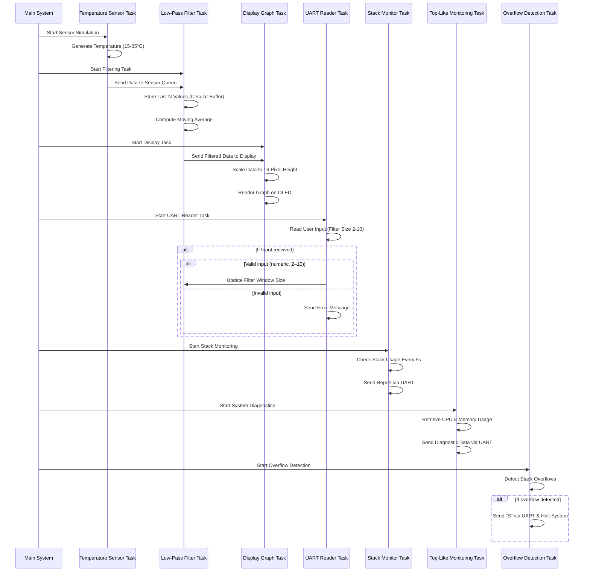

# **Real-Time Temperature Monitoring System with FreeRTOS**

## **Introduction**

This report presents the design and implementation of a **real-time temperature monitoring system** on the **Stellaris LM3S811 microcontroller** using **FreeRTOS**. The system simulates temperature sensor input, applies a dynamic **low-pass filtering mechanism**, and provides real-time user interaction via **UART**. The project has been developed and tested within a **QEMU** environment, ensuring efficient evaluation before deployment on physical hardware.

## **System Configuration**

The system operates on an embedded platform with the following specifications:

- **Target Hardware**: Stellaris LM3S811 microcontroller  
- **Simulation Environment**: QEMU  
- **Operating System**: FreeRTOS  
- **Communication Interface**: UART0 configured at **115200 baud**  

## **Data Processing Flow: Sensor → Filter → Display**

The system follows a structured data-processing pipeline composed of several tasks, each responsible for a distinct aspect of the workflow.

### **Temperature Sensor Simulation**

The **`vSimulateTemperatureSensorTask`** generates simulated temperature readings within the range of **15 to 35°C** using a **pseudo-random algorithm**. These values are then sent to **`xSensorDataQueue`**, where they await further processing.

### **Low-Pass Filtering Mechanism**

To smooth out variations in sensor readings, the **`vLowPassFilterTask`** maintains a **circular buffer** containing the last **N temperature values**. The buffer size is dynamically allocated using **`pvPortMalloc`**, ensuring flexibility in memory management.

A **moving average algorithm** processes the buffered values to refine the temperature readings, and the filtered values are then transmitted to **`xFilteredDataQueue`** for visualization.  

**Real-time configurability:** The value of **N** (the filter window size) can be adjusted dynamically via **UART commands**. 

### **Graphical Data Display**

The **`vDisplayGraphTask`** is responsible for graphical visualization. It scales filtered temperature values to a **16-pixel height** and updates an **OLED display (96×16 pixels)**, providing a real-time graphical representation of sensor data.

The graph is structured with a time axis (X-axis) representing consecutive temperature readings and a temperature axis (Y-axis) scaled to fit within the available display height. As new data points arrive, the graph updates dynamically, ensuring a real-time visualization of temperature fluctuations

## **User Interaction via UART**

To allow dynamic adjustments of filter parameters, the **`vUARTReaderTask`** listens for user input through UART. The task performs the following operations:

- Accepts numerical values ranging from **2 to 10** to modify the filter window size.  
- Echoes user inputs and error messages through UART.  
- Updates the **`filter_window_size`** parameter accordingly.  

## **Diagnostics and System Monitoring**

To ensure proper resource utilization and detect potential issues, the system incorporates several monitoring mechanisms.

### **Stack Usage Monitoring**

The **`vMonitorStackTask`** utilizes **`uxTaskGetStackHighWaterMark()`** to analyze the remaining stack space for each task. Reports are generated and sent via UART every **5 seconds**, helping detect stack-related constraints.

### **Task and Heap Diagnostics (Top-Like Command)**

The **`vTopLikeTask`** mimics the functionality of the **Linux `top` command**, providing detailed system diagnostics. Using **`uxTaskGetSystemState()`**, it collects metrics on:

- CPU usage of each task  
- Remaining stack space  
- Task states  

These statistics are displayed periodically via UART, allowing real-time monitoring through the serial interface.

Additionally, heap usage is monitored via **`xPortGetFreeHeapSize()`**, ensuring that memory consumption remains within safe limits. The task dynamically adjusts memory allocation using **`pvPortMalloc()`**, resizing only if required.

### **Stack Overflow Detection**

A **dedicated exception handler**, **`vApplicationStackOverflowHook()`**, is implemented to detect stack overflows. If an overflow occurs, the system sends an **'S' character** via UART before halting execution, enabling prompt identification of failure points.

## **Debugging and Simulation Environment**

The project has been extensively **tested within QEMU**, utilizing UART output as a primary debugging interface. Observing task behavior and monitoring filtered temperature values through UART enabled rigorous validation of system performance during development. However, UART prints related to temperature and filter size were removed from the final version to avoid excessive output that could obscure the task statistics displayed by the vTopLikeTask.

## **Sequence Diagram**

## **Conclusion**

This project effectively demonstrates multitasking capabilities in an embedded environment, with robust **inter-task communication mechanisms** utilizing **queues**. The system provides **real-time data visualization and interactive parameter tuning**, ensuring flexibility while operating within constrained hardware resources.

Particular emphasis has been placed on **memory efficiency, stack integrity, and system diagnostics**, ensuring a **reliable, optimized, and transparent** embedded solution.
